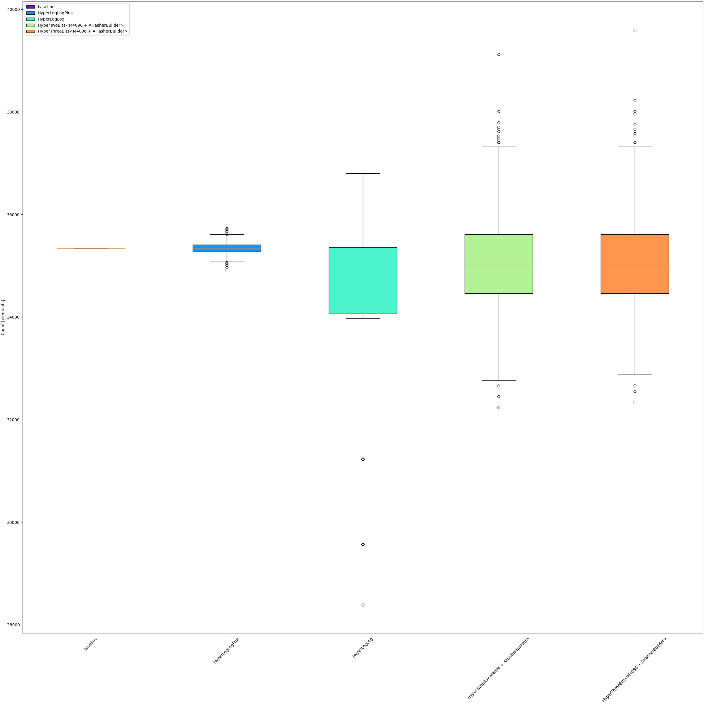

[](https://docs.rs/hypertwobits/)
[](https://github.com/axiomhq/hypertwobits/actions/workflows/rust.yml)
[](https://crates.io/crates/hypertwobits)
[](LICENSE-MIT)


[`HyperTwoBits`](https://www2.math.uu.se/~svantejs/papers/sj383-aofa.pdf) is a probabilistic data structure
that estimates the number of distinct elements in a set. It has the same use case as `HyperLogLog`, 
but it uses less memory and is faster while achieving roughly similar accuracy. In numbers while
`HyperLogLog` uses six bits per substream `HyperTwoBits` uses, as the name suggests, two bits

To illustrate Tabe 4 from the linked paper page 14:


This implementation improves on the proposed algorithm in a few ways. 
- It holds the entire sketch in the stack without heap allocations.
- It defaults to `ahash` for hashing, but you can use any hasher that implements `std::hash::AHasherBuilder`.
- It uses traits to remove branches from the runtime execution.
- It moves as much of the computation as possible into constants or compile-time evaluation.
- It removes float comparisons in favor of integer operations.
It uses 128-bit integers to take advantage of wide registers where possible.
- It uses intrinsics to count ones instead of computing them over binary logic.
- It changes the register layout for high/low bits in the scatch to colocate the memory for each region.
- It adds micro batching functions that improve performance when two or four values can be provided at the same time.

## Example

 ```rust
 use hypertwobits::{HyperTwoBits, M512};
 let mut htb = HyperTwoBits::<M512>::default();
 htb.insert(&"foo");
 htb.insert(&"bar");
 htb.count();
 ```


## Seeded Hash vs. Unseeded Hash
By default, `HyperTwoBits` uses `ahash` as the hasher. This hasher is **not** seeded with a random
value by default. This means that the same input will always produce the same output.

Unlike HashMap's the attack surface this opens up is minimal. The only way to exploit this is to 
craft an input that would deliberately return imprecise results. This is a non-issue for most use cases.

However, we provide the `AHasherBuilder` that creates a random state that is used to seed the hasher.
The tradeoff is that this will be slower, use more memory and means sketches can no longer be merged.

## Benchmarks

Based on [benchmarks](https://github.com/axiomhq/hypertwobits/actions/workflows/criterion.yml) it is about 2 times faster than `HyperLogLogPlus` and 1.5x faster than `HyperBitBit` or respectively 4x and 2.5x faster when used with non-seeded hashers.


## Accuracy

The accuracy of `HyperTwoBits` is roughyly similar to `HyperLogLog` but significantly inferior to `HyperLogLogPlus`. A few measurements based on example inputs:

### Shakespeare


### Ulysses



### War and Peace


